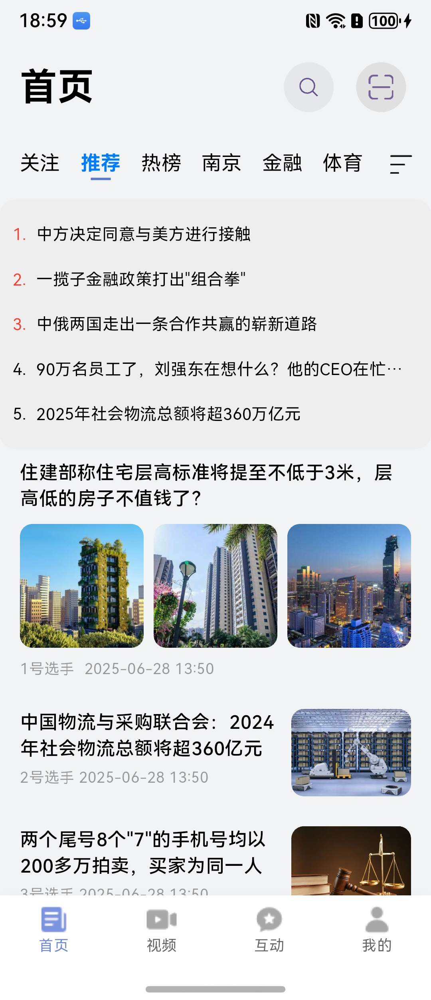
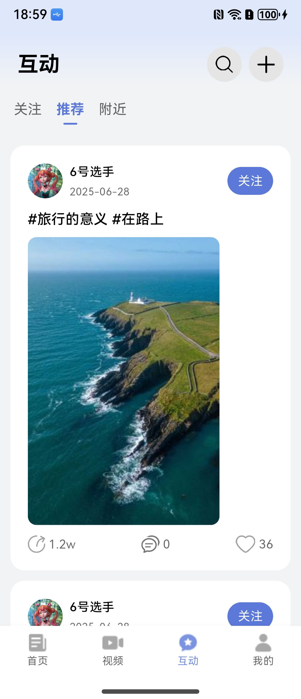
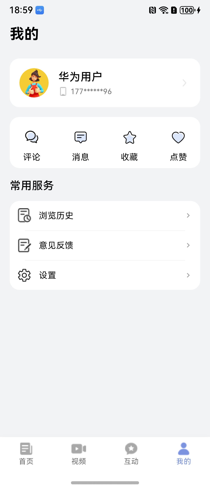
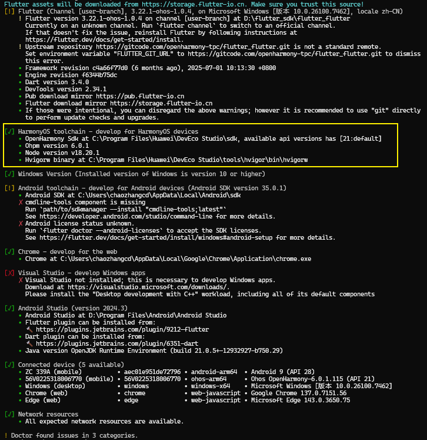

# 新闻（Flutter）应用模板快速入门

## 目录

- [功能介绍](#功能介绍)
- [约束与限制](#约束与限制)
- [快速入门](#快速入门)
- [示例效果](#示例效果)
- [开源许可协议](#开源许可协议)
- [附录](#附录)

## 功能介绍

您可以基于此模板直接定制应用，也可以挑选此模板中提供的多种组件使用，从而降低您的开发难度，提高您的开发效率。

此模板提供如下组件，所有组件存放在工程根目录的components下，如果您仅需使用组件，可参考对应组件的指导链接；如果您使用此模板，请参考本文档。

| 组件                         | 描述                     | 使用指导                                     |
| :------------------------- | :--------------------- | :--------------------------------------- |
| 频道编辑Flutter组件（module_flutter_channeledit） | 支持频道添加、删除              | [使用指导](components/module_flutter_channeledit/README.md) |
| 评论Flutter组件（module_flutter_feedcomment）   | 支持评论列表、发表评论、点赞回复       | [使用指导](components/module_flutter_feedcomment/README.md) |
| 高亮Flutter组件（module_flutter_highlight）     | 支持根据关键字高亮显示文本中命中关键词的部分 | [使用指导](components/module_flutter_highlight/README.md) |

本模板为新闻类应用提供了常用功能的开发样例，模板主要分首页、视频、互动和我的四大模块：

* 首页：提供推荐新闻信息流、搜索、扫码、热榜、本地等功能。
* 视频：提供关注、精选、推荐短视频以及直播等功能。
* 互动：支持查看关注、推荐、附近博主发文、支持一键发帖。
* 我的：提供个人主页查看、评论、消息、管理收藏/点赞/浏览历史、意见反馈、设置等功能。

本模板已集成华为账号、推送、朗读、无障碍屏幕朗读、适老化、微信QQ登录分享等服务，适配双折叠一多布局、附近定位频道，提供首页新闻动态布局能力，只需做少量配置和定制即可快速实现新闻阅读等功能。

| 首页                                       | 视频                                       | 互动                                       | 我的                                       |
| ---------------------------------------- | ---------------------------------------- | ---------------------------------------- | ---------------------------------------- |
|  |  |  |  |

本模板主要页面及核心功能如下所示：

```text
综合新闻Flutter模板
  ├──首页                           
  │   ├──顶部栏-搜索  
  │   │   ├── 历史搜索                          
  │   │   └── 热门搜索                      
  │   │         
  │   ├──顶部栏-扫码         
  │   │                    
  │   ├──顶部栏-导航栏    
  │   │   ├── 关注、推荐、热榜、本地等                                             
  │   │   └── 频道编辑
  │   │
  │   ├──新闻列表    
  │   │   ├── 动态布局                                             
  │   │   └── 信息流                         
  │   │  
  │   │
  │   └──新闻详情    
  │       ├── 图文                                             
  │       ├── 视频文                         
  │       ├── 听新闻
  │       ├── 收藏、点赞、评论（评论、回复）、评论详情                         
  │       ├── 分享（微信、QQ、复制链接等）
  │       └── 相关推荐 
  │
  ├──视频                           
  │   ├──顶部栏  
  │   │   ├── 关注 
  │   │   ├── 精选
  │   │   ├── 本地
  │   │   ├── 推荐 
  │   │   ├── 直播                        
  │   │   └── 搜索                      
  │   │         
  │   └──视频详情页         
  │       ├── 竖屏播放
  │       ├── 横屏播放
  │       ├── 播放、暂停、进度调节、倍速
  │       └── 关注、点赞、收藏、评论、分享                            
  │                        
  ├──互动                           
  │   ├──顶部栏  
  │   │   ├── 搜索                          
  │   │   ├── 发帖                                                   
  │   │   ├── 关注
  │   │   ├── 推荐                       
  │   │   └── 附近                      
  │   │         
  │   ├──帖子列表         
  │   │   ├── 图文                               
  │   │   └── 关注、点赞、评论、分享                            
  │   │                    
  │   └──帖子详情    
  │       ├── 图文                                             
  │       ├── 语音播报                         
  │       ├── 收藏/点赞/评论/分享                                 
  │       └── 相关推荐                       
  │
  └──我的                           
      ├──登录  
      │   ├── 华为账号一键登录                          
      │   ├── 微信登录                                                   
      │   ├── 账密登录
      │   └── 用户隐私协议同意                       
      │         
      ├──个人主页         
      │   ├── 头像、昵称、简介
      │   ├── 关注、粉丝、获赞
      │   └── 文章、视频、动态
      │                    
      ├──分类导航栏    
      │   ├── 评论                                        
      │   ├── 消息                   
      │   ├── 收藏                             
      │   └── 点赞
      │
      └──常用服务    
          ├── 浏览历史                                        
          ├── 意见反馈                   
          └── 设置
               ├── 编辑个人信息             
               ├── 隐私设置           
               ├── 通知开关  
               ├── 播放与网络设置             
               ├── 清理缓存           
               ├── 字体大小 
               ├── 检测版本 
               ├── 关于我们 
               └── 退出登录                               
```

本模板工程代码结构如下所示：

```text
newsflutter
├──lib                                                     // Flutter应用主目录
│  ├──main.dart                                            // 应用入口
│  ├──index_page.dart                                      // 主页面
│  ├──constants                                            // 常量文件
│  └──pages                                                // 页面
│
├──commons                                                 // 公共工具库
│  ├──lib_account                                          // 账号登录模块             
│  │    ├──lib
│  │    │   ├──components
│  │    │   │   └──agree_privacy_box.dart                  // 隐私同意勾选                  
│  │    │   ├──pages  
│  │    │   │   ├──huawei_login_page.dart                  // 华为账号登录页面
│  │    │   │   ├──other_login_page.dart                   // 其他方式登录页面
│  │    │   │   └──protocol_webview.dart                   // 协议H5                  
│  │    │   └──utils  
│  │    │       ├──error_code_helper.dart                  // 错误码处理工具类
│  │    │       ├──huawei_auth_utils.dart                  // 华为认证工具类
│  │    │       ├──login_sheet_utils.dart                  // 统一登录弹窗
│  │    │       └──wx_api_utils.dart                       // 微信登录事件处理类 
│  │    └──pubspec.yaml                                    // 模块依赖配置
│  │
│  ├──lib_common                                           // 基础模块             
│  │    ├──lib
│  │    │   ├──constants                                   // 通用常量 
│  │    │   ├──datasource                                  // 数据源
│  │    │   ├──dialogs                                     // 通用弹窗 
│  │    │   ├──models                                      // 数据模型
│  │    │   ├──push                                        // 推送
│  │    │   ├──styles                                      // 样式
│  │    │   └──utils                                       // 通用方法     
│  │    └──pubspec.yaml                                    // 模块依赖配置
│  │
│  ├──lib_flex_layout                                      // 动态布局模块             
│  │    ├──lib
│  │    │   ├──components
│  │    │   │   ├──load_more_footer.dart                   // 加载更多
│  │    │   │   ├──news_tab_content.dart                   // Tab视图
│  │    │   │   ├──no_login_page.dart                      // 未登录视图
│  │    │   │   └──flex_layout_page.dart                   // 动态布局入口    
│  │    │   └──views
│  │    │       └──flex_layout.dart                        // 动态布局列表页 
│  │    └──pubspec.yaml                                    // 模块依赖配置
│  │
│  ├──lib_native_components                                // 原生组件桥接模块             
│  │    ├──lib
│  │    │   ├──components
│  │    │   │   ├──advertisement_card.dart                 // 广告卡片
│  │    │   │   ├──feed_details_card.dart                  // 动态卡片
│  │    │   │   ├──hot_list_service_switch_card.dart       // 热榜切换组件
│  │    │   │   ├──hot_news_service_card.dart              // 热榜新闻
│  │    │   │   ├──left_text_right_image_card.dart         // 左文右图卡片
│  │    │   │   ├──top_text_bottom_big_image_card.dart     // 上文下图大卡
│  │    │   │   ├──top_text_bottom_image_card.dart         // 上文下图卡片
│  │    │   │   ├──top_text_bottom_video_card.dart         // 上文下视频卡片
│  │    │   │   └──vertical_big_image_card.dart            // 上下布局大图
│  │    │   └──utils 
│  │    │       └──card_utils.dart                         // 卡片工具类         
│  │    └──pubspec.yaml                                    // 模块依赖配置
│  │
│  ├──lib_news_api                                         // 服务端api模块             
│  │    ├──lib
│  │    │   ├──constants                                   // 常量文件    
│  │    │   ├──database                                    // 数据库 
│  │    │   ├──models                                      // 数据模型  
│  │    │   ├──params                                      // 请求响应参数 
│  │    │   ├──services                                    // 服务api  
│  │    │   └──utils                                       // 工具utils 
│  │    └──pubspec.yaml                                    // 模块依赖配置
│  │
│  ├──lib_news_feed_details                                // 新闻详情模块             
│  │    ├──lib
│  │    │   ├──components
│  │    │   │   ├──article_details_footer.dart             // 文章底部区域
│  │    │   │   ├──news_content.dart                       // 新闻主体内容
│  │    │   │   └──recommend_area.dart                     // 相关推荐                  
│  │    │   └──views  
│  │    │       └──article_feed_details.dart               // 新闻详情页      
│  │    └──pubspec.yaml                                    // 模块依赖配置
│  │
│  ├──lib_preview_page                                     // 预览模块             
│  │    ├──lib
│  │    │   └──components
│  │    │       └──image_preview_page.dart                 // 图片预览视图                  
│  │    └──pubspec.yaml                                    // 模块依赖配置
│  │ 
│  └──lib_widget                                           // 通用UI模块             
│      ├──lib
│      │   └──components
│      │       ├──button_group.dart                        // 组合按钮
│      │       ├──custom_badge.dart                        // 自定义信息标记组件
│      │       ├──empty_builder.dart                       // 空白组件
│      │       ├──nav_header_bar.dart                      // 自定义标题栏
│      │       └──news_search_transition.dart              // 搜索动画
│      └──pubspec.yaml                                     // 模块依赖配置
│
├──components                                              // 业务组件层
│  ├──module_flutter_channeledit                           // 频道编Flutter辑组件
│  ├──module_feedback                                      // 意见反馈组件
│  ├──module_flutter_feedcomment                           // 评论Flutter组件
│  ├──module_flutter_highlight                             // 高亮Flutter组件
│  ├──module_imagepreview                                  // 图片预览组件
│  ├──module_newsfeed                                      // 动态卡片组件
│  ├──module_post                                          // 发帖组件
│  ├──module_setfontsize                                   // 字体大小调节组件
│  ├──module_share                                         // 分享组件
│  └──module_swipeplayer                                   // 视频组件
│      
├──features                                                // 业务功能层
│  ├──business_home                                        // 首页模块             
│  │    ├──lib
│  │    │   ├──components
│  │    │   │   └──news_search.dart                        // 搜索页面                  
│  │    │   └──pages
│  │    │       └──home_page.dart                          // 首页页面
│  │    └──pubspec.yaml                                    // 模块依赖配置
│  │
│  ├──business_interaction                                 // 互动模块             
│  │    ├──lib
│  │    │   ├──components
│  │    │   │   ├──interaction_feed_card.dart              // 动态卡片
│  │    │   │   ├──interaction_tab_content.dart            // 动态列表
│  │    │   │   ├──no_watcher.dart                         // 暂无关注
│  │    │   │   └──top_bar.dart                            // 顶部Tab                  
│  │    │   └──pages 
│  │    │       ├──interaction_page.dart                   // 互动主页面
│  │    │       └──publish_post_page.dart                  // 发帖页面                  
│  │    └──pubspec.yaml                                    // 模块依赖配置
│  │
│  ├──business_mine                                        // 我的模块             
│  │    ├──lib
│  │    │   ├──components
│  │    │   │   ├──base_history_comment.dart               // 历史、评论基础页面
│  │    │   │   ├──base_mark_like_page.dart                // 收藏、点赞基础页面
│  │    │   │   ├──cancel_dialog_builder.dart              // 取消收藏点赞弹窗
│  │    │   │   ├──comment_root.dart                       // 主评论
│  │    │   │   ├──comment_sub.dart                        // 从属评论
│  │    │   │   ├──fan_item.dart                           // 粉丝单元
│  │    │   │   ├──im_item.dart                            // 私信单元
│  │    │   │   ├──message_item.dart                       // 消息单元
│  │    │   │   ├──set_read_icon.dart                      // 标记已读
│  │    │   │   └──uniform_news_card.dart                  // 统一新闻卡片                
│  │    │   └──pages 
│  │    │       ├──comment_page.dart                       // 评论页面
│  │    │       ├──history_page.dart                       // 我的历史
│  │    │       ├──like_page.dart                          // 我的点赞
│  │    │       ├──mark_page.dart                          // 我的收藏
│  │    │       ├──message_comment_reply_page.dart         // 评论与回复
│  │    │       ├──message_fans_page.dart                  // 新增粉丝
│  │    │       ├──message_im_chat_page.dart               // 聊天页面
│  │    │       ├──message_im_list_page.dart               // 私信列表
│  │    │       ├──message_page.dart                       // 消息页面
│  │    │       ├──message_single_comment_list.dart        // 全部回复页面
│  │    │       ├──message_system_page.dart                // 系统消息
│  │    │       └──mine_page.dart                          // 我的页面              
│  │    └──pubspec.yaml                                    // 模块依赖配置
│  │
│  ├──business_profile                                     // 个人主页模块             
│  │    ├──lib
│  │    │   ├──components
│  │    │   │   ├──author_item.dart                        // 作者单元
│  │    │   │   ├──base_follow_watch_page.dart             // 关注粉丝基础页面
│  │    │   │   ├──dialog_like_num.dart                    // 获赞弹窗
│  │    │   │   ├──tab_bar.dart                            // 顶部Tab
│  │    │   │   ├──uniform_news.dart                       // 统一新闻卡片
│  │    │   │   ├──user_intro.dart                         // 用户信息
│  │    │   │   └──watch_button.dart                       // 关注按钮                
│  │    │   └──pages
│  │    │       ├──follower_page.dart                      // 粉丝页面
│  │    │       ├──personal_home_page.dart                 // 个人主页
│  │    │       └──watch_page.dart                         // 关注页面  
│  │    └──pubspec.yaml                                    // 模块依赖配置
│  │
│  ├──business_setting                                     // 设置模块             
│  │    ├──lib
│  │    │   ├──components
│  │    │   │   ├──setting_card.dart                       // 设置卡片
│  │    │   │   └──setting_select_dialog.dart              // 设置选项弹窗               
│  │    │   └──pages
│  │    │       ├──setting_about.dart                      // 关于页面
│  │    │       ├──setting_font.dart                       // 字体大小设置页面
│  │    │       ├──setting_h5.dart                         // H5页面
│  │    │       ├──setting_network.dart                    // 播放与网络设置页面
│  │    │       ├──setting_page.dart                       // 设置页面
│  │    │       ├──setting_personal.dart                   // 编辑个人信息页面
│  │    │       └──setting_privacy.dart                    // 隐私设置页面   
│  │    └──pubspec.yaml                                    // 模块依赖配置
│  │ 
│  └──business_video                                       // 视频模块             
│      ├──lib
│      │   ├──components
│      │   │   ├──comment_view.dart                        // 评论视图
│      │   │   ├──live_highlights_view.dart                // 直播回放视图
│      │   │   ├──live_notice_preview.dart                 // 直播公告视图
│      │   │   ├──livestream_card.dart                     // 直播卡片视图
│      │   │   ├──livestream_footer_view.dart              // 直播底部视图
│      │   │   ├──sidebar.dart                             // 侧边栏视图
│      │   │   ├──tab_header_view.dart                     // 顶部Tab视图
│      │   │   └──video_layer_view.dart                    // 视频外层操作层视图
│      │   ├──pages
│      │   │   ├──comment_view_page.dart                   // 评论页面
│      │   │   ├──livestream_detail_page.dart              // 直播详情页面
│      │   │   ├──video_detail_page.dart                   // 视频详情页
│      │   │   └──video_page.dart                          // 视频首页
│      │   └──views
│      │       ├──featured_page.dart                       // 精选页面               
│      │       ├──follow_page.dart                         // 关注页面
│      │       ├──introduction_view.dart                   // 直播介绍视图
│      │       ├──live_comment_view.dart                   // 直播评论视图
│      │       ├──livestream_page.dart                     // 直播列表页面
│      │       ├──recommend_page.dart                      // 推荐页面
│      │       └──video_swiper_page.dart                   // 短视频轮播页面
│      └──pubspec.yaml                                     // 模块依赖配置
│
├──ohos                                                    // HarmonyOS平台配置
│  └──entry                                                // 入口模块
│      ├──src/main/ets
│      │   └──entryability
│      │       └──EntryAbility.ets                         // 原生入口能力
│      └──src/main
│          └──module.json5                                 // 模块配置
│
├──assets                                                  // 资源文件
│  ├──icons                                                // 图标文件夹
│  ├──ic_paused.png                                        // 暂停图标
│  ├──ic_public_brush.svg                                  // 画笔图标
│  ├──ic_security.svg                                      // 安全图标
│  ├──ic_start_background.png                              // 启动背景
│  ├──ic_tab_home.svg                                      // 首页标签图标
│  ├──ic_tab_interaction.svg                               // 互动标签图标
│  ├──ic_tab_mine.svg                                      // 我的标签图标
│  ├──ic_tab_video.svg                                     // 视频标签图标
│  ├──icon_default.png                                     // 默认图标
│  ├──no_watch.png                                         // 无关注图标
│  └──startIcon.png                                        // 启动图标
│
├──screenshots                                             // 截图
│  ├──clound_function.png                                  // 云函数截图
│  ├──fontsetting.jpg                                      // 字体设置截图
│  ├──home.jpg                                             // 首页截图
│  ├──homefold.jpg                                         // 首页折叠截图
│  ├──interaction.jpg                                      // 互动页截图
│  ├──mine.jpg                                             // 我的页截图
│  ├──post.jpg                                             // 发帖截图
│  ├──preload.png                                          // 预加载截图
│  └──video.jpg                                            // 视频页截图
│
├──README.md                                               // 项目说明文档
├──.gitignore                                              // Git忽略文件配置
├──analysis_options.yaml                                   // 代码分析配置
├──pubspec.yaml                                            // Flutter依赖配置
├──.metadata                                               // Flutter元数据
├──Untitled-1.json                                         // JSON配置文件
└──devtools_options.yaml                                   // DevTools配置
 
```

## 约束与限制

### 环境

- DevEco Studio版本：DevEco Studio 5.1.0 Release及以上
- HarmonyOS SDK版本：HarmonyOS  5.1.0 Release SDK及以上
- 设备类型：华为手机（包括双折叠）
- 系统版本：HarmonyOS 5.1.0(18)及以上
- Flutter SDK版本：基于Flutter 3.22.1适配的OpenHarmony发行版本，tag:3.22.1-ohos-1.0.4
- Dart版本：Dart 3.4.0及以上

### 权限

- 网络权限: ohos.permission.INTERNET, 
- 网络状态权限：ohos.permission.GET_NETWORK_INFO
- 跨应用关联权限: ohos.permission.APP_TRACKING_CONSENT
- 存储权限：用于保存图片、视频、缓存数据
- 相册权限：用于选择图片、视频上传
- 相机权限：用于拍照、录像功能

## 快速入门

### 配置环境

以下环境变量配置，类似Unix系统（Linux、Mac），可参照配置，Windows下环境变量配置请在“编辑系统环境变量”中设置。

1. 配置HarmonyOS环境变量 (HarmonyOS SDK、node、ohpm、hvigor)。

   ```
   export TOOL_HOME=/Applications/DevEco-Studio.app/Contents # mac环境
   export DEVECO_SDK_HOME=$TOOL_HOME/sdk 
   export PATH=$TOOL_HOME/tools/ohpm/bin:$PATH 
   export PATH=$TOOL_HOME/tools/hvigor/bin:$PATH 
   export PATH=$TOOL_HOME/tools/node/bin:$PATH
   ```

   在 Windows 上还需要配置一个名为HOS_SDK_HOME的系统变量，值为DevEco Studio sdk的安装路径，示例如下：

   


2. 通过代码工具下载flutter sdk仓库代码，tag为 `3.22.1-ohos-1.0.1`。

   ```
    git clone -b 3.22.1-ohos-1.0.1 https://gitcode.com/openharmony-tpc/flutter_flutter.git
   ```

   并配置如下环境：

   ```
    export PUB_CACHE=D:/PUB(自定义路径)
    export PATH=<flutter_flutter path>/bin:$PATH
    export FLUTTER_GIT_URL=https://gitcode.com/openharmony-tpc/flutter_flutter.git
    export PUB_HOSTED_URL=https://pub.flutter-io.cn #国内的镜像，也可以使用其他镜像，比如清华镜像源
    export FLUTTER_STORAGE_BASE_URL=https://storage.flutter-io.cn #国内的镜像，也可以使用其他镜像，比如清华镜像源
   ```

   Windows 环境变量配置示例如下（请按照实际安装目录配置）：

   - 系统变量

     

   - 环境变量

     


### 检查环境

运行 `flutter doctor -v` 检查环境变量配置是否正确，**Futter**与**OpenHarmony**应都为ok标识，若两处提示缺少环境，按提示补充相应环境即可（**Futter**处为感叹号标识无影响）。



### 配置工程

在运行此模板前，需要完成以下配置：

1. 在AppGallery Connect创建应用，将包名配置到模板中。

   a. 参考[创建HarmonyOS应用](https://developer.huawei.com/consumer/cn/doc/app/agc-help-create-app-0000002247955506) ，为应用创建APP ID，并将APP ID与应用进行关联。

   b. 返回应用列表页面，查看应用的包名。

   c. 将模板工程根目录下ohos/AppScope/app.json5文件中的bundleName替换为创建应用的包名。

2. 配置华为账号服务(跨端需做插件配置)。

   a. 将应用的Client ID配置到ohos/products/phone/src/main路径下的module.json5文件中，
   详细参考：[配置Client ID](https://developer.huawei.com/consumer/cn/doc/harmonyos-guides/account-client-id)。

   b. 申请华为账号一键登录所需的quickLoginMobilePhone权限，详细参考：[配置scope权限](https://developer.huawei.com/consumer/cn/doc/harmonyos-guides/account-config-permissions)。

3. 接入微信SDK(跨端需做插件配置)。

   前往微信开放平台申请`AppID`并配置鸿蒙应用信息，详情参考：[鸿蒙接入指南](https://developers.weixin.qq.com/doc/oplatform/Mobile_App/Access_Guide/ohos.html)。

4. 接入QQ(跨端需做插件配置)。

   前往QQ开放平台申请`AppID`并配置鸿蒙应用信息，详情参考：[鸿蒙接入指南](https://wiki.connect.qq.com/sdk%e4%b8%8b%e8%bd%bd)。


### 运行调试工程

1. 进入本组件的flutter工程目录，通过终端执行 `flutter pub get`和 `flutter build hap`。
2. 通过DevEco Studio打开工程目录中 `ohos`工程，连接模拟器或者真机，[手工配置签名](https://developer.huawei.com/consumer/cn/doc/harmonyos-guides/ide-signing#section297715173233)。
3. 添加手工签名所用证书对应的公钥指纹，详细参考：[配置应用签名证书指纹](https://developer.huawei.com/consumer/cn/doc/app/agc-help-cert-fingerprint-0000002278002933)。
4. 在flutter工程目录或者子目录 `ohos`中，通过 `flutter devices`指令发现ohos设备。
5. 在flutter工程目录中，通过`flutter run -d <device-id>`指令运行调试，也可以通过DevEco Studio点击Run运行ohos工程（适合真机，模拟器不适用）。​


## 示例效果

1. [首页](screenshots/home.jpg)
2. [视频](screenshots/video.jpg)
3. [发帖](screenshots/post.jpg)
4. [我的](screenshots/mine.jpg)
5. [大字体](screenshots/fontsetting.jpg)
6. [折叠屏-首页](screenshots/homefold.jpg)

## 开源许可协议

该代码经过[Apache 2.0 授权许可](http://www.apache.org/licenses/LICENSE-2.0)。

## 附录

### 常用三方SDK

| 分类   | 三方库名称                                    | 功能描述          |
| ---- | ---------------------------------------- | ------------- |
| 分享   | [MobLink ](https://developer.huawei.com/consumer/cn/market/prod-detail/c88909dd0c9146dc87d675038773ccd2/f897ac2dbdde447180e9bb61dc4eb0d1)/ [微信分享](https://developers.weixin.qq.com/doc/oplatform/Mobile_App/Share_and_Favorites/ohos.html) / [QQ分享](https://wiki.connect.qq.com/harmonyos_sdk%e7%8e%af%e5%a2%83%e6%90%ad%e5%bb%ba) / [新浪微博SDK](https://developer.huawei.com/consumer/cn/market/prod-detail/7afe7ff8e74e4585941f738c09e7c06f/PLATFORM) | 推送/分享         |
| 数据分析 | [神策分析](https://developer.huawei.com/consumer/cn/market/prod-detail/a629e0eeab9c44f9a6f15e0727bc92ca/PLATFORM) / [友盟common SDK ](https://developer.huawei.com/consumer/cn/market/prod-detail/14d21b00a4d34ff3be00dec7597ab5d7/0277100bd59f45e38d8a0de52e1119b2) | 数据收集、处理、分析、运用 |
| 性能监控 | [腾讯Bugly ](https://developer.huawei.com/consumer/cn/market/prod-detail/eea993bb84ec4627aefac94c86d37601/PLATFORM)/ [听云SDK](https://developer.huawei.com/consumer/cn/market/prod-detail/2acb6ccef6a04820a230627ab1ee87b9/03d0f883f0c54f1aa97cb895ac68fb3a) | 异常上报和运营统计     |
| 媒体   | [阿里云视频播放器SDK](https://help.aliyun.com/zh/apsaravideo-for-vod/use-cases/harmonyos-next-sdk-integration) | 音视频           |
| 地图   | [高德地图SDK](https://lbs.amap.com/api/harmonyos-sdk/summary) | 地图            |


