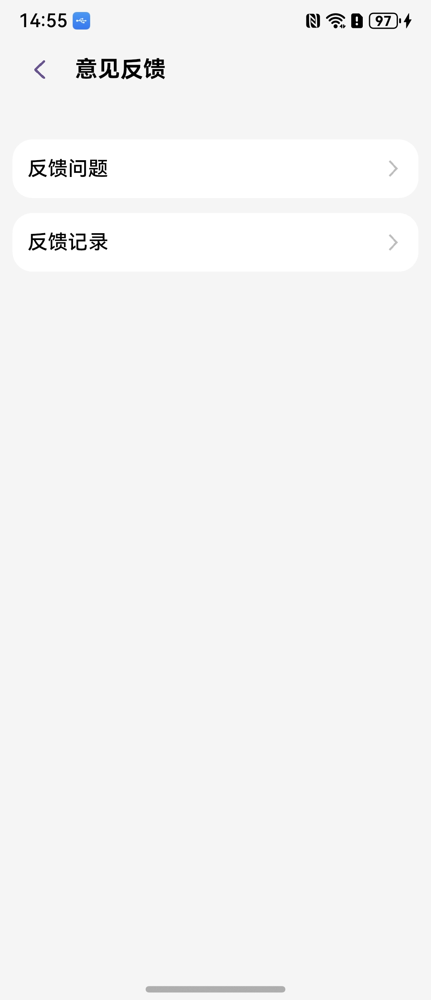
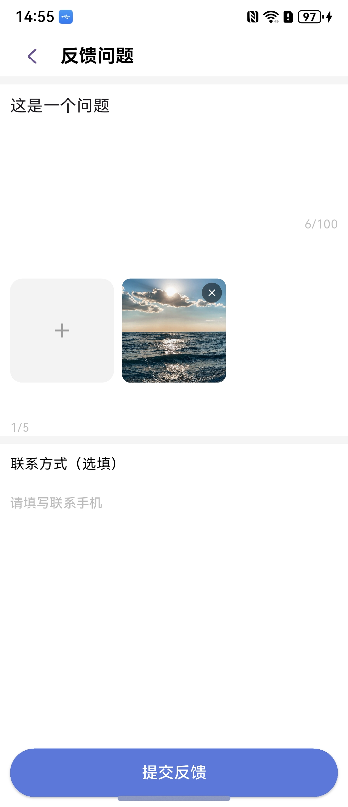
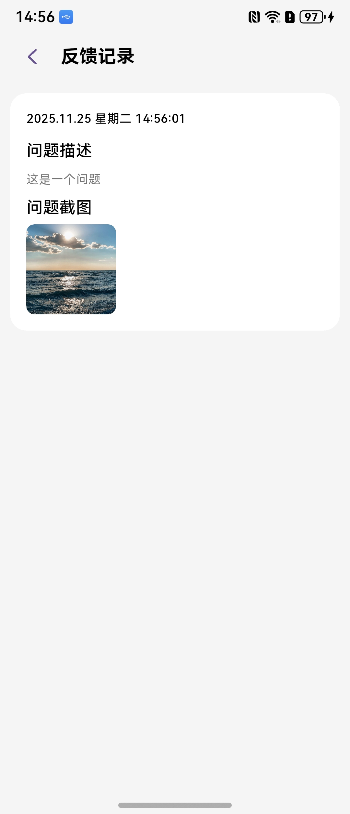

# 意见反馈组件快速入门

## 目录

- [简介](#简介)
- [约束与限制](#约束与限制)
- [快速入门](#快速入门)
- [API参考](#API参考)
- [示例代码](#示例代码)

## 简介

本组件支持提交问题反馈、查看反馈记录。


| 意见反馈                                           | 反馈问题                                             | 反馈记录                                             |
|------------------------------------------------|--------------------------------------------------|--------------------------------------------------|
|  |  |  |


## 约束与限制

### 环境

- `DevEco Studio版本`：`DevEco Studio` `5.1.0 Release`及以上
- `HarmonyOS SDK版本`：`HarmonyOS 5.1.0 ·Release SDK`及以上
- `设备类型`：华为手机（包括双折叠）
- `系统版本`：`HarmonyOS 5.1.0(18)`及以上
- `Flutter版本`：`Flutter 3.22.1-ohos-1.0.4`
- `Dart版本`：`Dart 3.4.0`及以上

### 权限

- `存储权限`：上传图片需要访问相册
- `网络权限`：提交反馈需要网络连接

## 快速入门

1. 安装组件。

   如果是在`DevEco Studio`使用插件集成组件，则无需安装组件，请忽略此步骤。

   如果是从生态市场下载组件，请参考以下步骤安装组件。

   a. 解压下载的组件包，将包中所有文件夹拷贝至您工程根目录的`components`目录下。

   b. 在项目根目录`pubspec.yaml`文件中添加`module_feedback`模块。

   ```yaml
   dependencies:
     module_feedback:
       path: ./components/module_feedback
     lib_common:
       path: ./commons/lib_common
   ```

   c. 运行命令获取依赖：

   ```bash
   flutter pub get
   ```

2. 引入组件。

   ```dart
   import 'package:module_feedback/pages/submit_page.dart';
   import 'package:module_feedback/pages/record_list_page.dart';
   ```

3. 调用组件，详细组件调用参见[示例代码](#示例代码)。

```dart
// 提交反馈
Navigator.push(
  context,
  MaterialPageRoute(
    builder: (context) => const SubmitPage(),
  ),
);

// 查看反馈记录
Navigator.push(
  context,
  MaterialPageRoute(
    builder: (context) => const RecordListPage(),
  ),{}
);
```

## API参考

### 接口

#### `SubmitPage`

反馈提交页面。

```dart
const SubmitPage({Key? key})
```

#### `RecordListPage`

反馈记录列表页面。

```dart
const RecordListPage({Key? key})
```

#### `FeedbackManagePage`

反馈管理页面（管理员使用）。

```dart
const FeedbackManagePage({Key? key})
```

## 示例代码

```dart
import 'package:flutter/material.dart';
import 'package:module_feedback/pages/submit_page.dart';
import 'package:module_feedback/common/feedback_model.dart';

class Sample1 extends StatelessWidget {
  final FeedbackModel feedbackModel = FeedbackModel();

  Sample1({super.key});

  @override
  Widget build(BuildContext context) {
    return Scaffold(
      body: Padding(
        padding: const EdgeInsets.symmetric(horizontal: 16.0),
        child: Column(
          mainAxisAlignment: MainAxisAlignment.spaceEvenly,
          crossAxisAlignment: CrossAxisAlignment.center,
          children: [
            const Text(
              '意见反馈',
              style: TextStyle(
                fontSize: 20,
                fontWeight: FontWeight.bold,
              ),
            ),
            SizedBox(
              width: double.infinity,
              child: ElevatedButton(
                onPressed: () {
                  Navigator.push(
                    context,
                    MaterialPageRoute(
                      builder: (context) => SubmitPage(
                        feedbackModel: feedbackModel,
                      ),
                    ),
                  );
                },
                child: const Text('提交反馈'),
              ),
            ),
          ],
        ),
      ),
    );
  }
}
```
