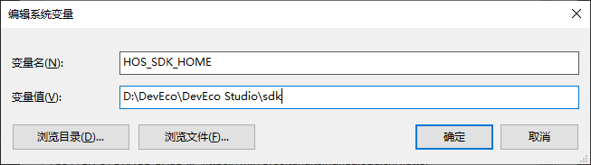
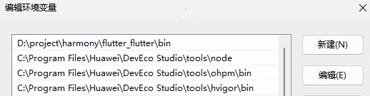
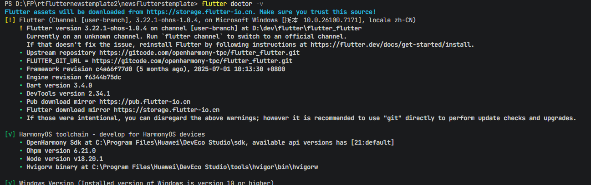

# 频道编辑Flutter组件快速入门

## 目录

- [简介](#简介)
- [约束与限制](#约束与限制)
- [快速入门](#快速入门)
- [API参考](#api参考)
- [示例代码](#示例代码)
- [注意事项](#注意事项)
- [参考文档](#参考文档)

## 简介

module_flutter_channeledit 是一个 Flutter跨端频道管理组件，支持在 HarmonyOS 平台使用，提供完整的频道管理功能。如果您的新闻类Flutter项目中需要使用频道管理功能，可以直接将此组件集成到项目中。包括频道切换、添加/删除频道等操作，适用于新闻、内容聚合类应用的分类管理。

组件包含的主要功能如下：
- 频道展示：水平滚动展示已选频道列表，支持点击切换
- 频道编辑
  - 添加频道：从推荐频道中选择添加新频道
  - 删除频道：移除不需要的已选频道
  - 固定频道：支持设置不可编辑的固定频道（如"关注"、"推荐"）
- 字体大小调整：支持自定义频道文字显示大小

本组件工程代码结构如下所示：

```text
module_flutter_channeledit/
├── lib/
│   ├── components/
│   │   ├── channels_sort_edit.dart   // 频道排序编辑组件
│   │   └── custom_tab_bar.dart       // 自定义标签栏组件
│   ├── constants/
│   │   └── constants.dart            // 常量定义文件
│   ├── model/
│   │   └── model.dart                // 数据模型定义
│   ├── views/
│   │   └── channel_edit.dart         // 频道编辑主视图
│   └── module_channeledit.dart       // 组件导出入口文件
├── assets/
│   ├── add.svg                       // 添加图标
│   ├── channel.png                   // 频道展示截图
│   ├── delete.svg                    // 删除图标
│   ├── ic_search_simple.svg          // 搜索图标
│   └── tab_more.svg                  // 更多选项图标
├── README.md                         // 组件说明文档
└── pubspec.yaml                      // 组件依赖配置
```


## 约束与限制

### 环境

- DevEco Studio版本：DevEco Studio 5.1.0 Release及以上
- HarmonyOS SDK版本：HarmonyOS 5.1.0 Release SDK及以上
- 设备类型：华为手机（包括双折叠）
- 系统版本：HarmonyOS 5.1.0(18)及以上（模板配置编译版本需要和DevEco Studio侧版本一致）
- Flutter版本：Flutter 3.22.1-ohos-1.0.4
- Dart版本：Dart 3.4.0及以上


## 快速入门
### 配置环境

以下环境变量配置，类似 Unix 系统（Linux、Mac），可参照配置，Windows 下环境变量配置请在"编辑系统环境变量"中设置。

  1. 配置 HarmonyOS 环境变量（HarmonyOS SDK、node、ohpm、hvigor）：

     ```
     export TOOL_HOME=/Applications/DevEco-Studio.app/Contents # mac环境
     export DEVECO_SDK_HOME=$TOOL_HOME/sdk 
     export PATH=$TOOL_HOME/tools/ohpm/bin:$PATH 
     export PATH=$TOOL_HOME/tools/hvigor/bin:$PATH 
     export PATH=$TOOL_HOME/tools/node/bin:$PATH
     ```

     在 Windows 上还需要配置一个名为 HOS_SDK_HOME 的系统变量，值为 DevEco Studio SDK 的安装路径，示例如下：

     

     asd

  2. 通过代码工具下载 Flutter SDK 仓库代码，tag 为 3.22.1-ohos-1.0.4：


```
git clone -b 3.22.1-ohos-1.0.4 https://gitcode.com/openharmony-tpc/flutter_flutter.git
```

    - 系统变量截图
         
    - 环境变量截图
         

### 检查环境

运行 flutter doctor -v 检查环境变量配置是否正确，**Flutter**与**OpenHarmony**应都为ok标识，若两处提示缺少环境，按提示补充相应环境即可（**Flutter**处为感叹号标识无影响）。



### 运行调试工程

#### 方式一：基于本 Flutter 工程直接运行

1. 进入本组件的 Flutter 工程目录，通过终端执行 flutter pub get 和 flutter build hap。
2. 通过 DevEco Studio 打开工程目录中的 ohos 工程，连接模拟器或者真机，手工配置签名。
3. 在 Flutter 工程目录或者子目录 ohos 中，通过 flutter devices 指令发现 ohos 设备。
4. 在 Flutter 工程目录中，通过 flutter run -d <device-id> 指令运行调试，也可以通过 DevEco Studio 点击 Run 运行 ohos 工程（适合真机，模拟器不适用）。

#### 方式二：创建 Flutter 工程运行

1. 创建工程：

   ```
   # 创建工程，工程名支持小写和下划线
   flutter create --platforms ohos <projectName>
   ```
2. 拷贝 Flutter 工程内容和配置身份标识。

   将本组件 Flutter 工程中 lib、assets、pubspec.yaml 等文件拷贝到当前新建工程中，并且将身份标识 assets/string.json
   文件中的内容，附加在当前新建工程的文件 ohos/entry/src/main/resources/base/element/string.json 中。
3. 编译运行。

   在当前新建的 Flutter 工程目录下，编译运行的详细步骤请参考 [运行调试工程](#运行调试工程) 的方式一。
### 安装组件

#### 步骤 1：添加依赖

   完成以上步骤后从生态市场下载组件，请参考以下步骤安装组件。

   a. 解压下载的组件包，将包中所有文件夹拷贝至您工程根目录的components目录下。

   b. 在项目根目录pubspec.yaml文件中添加module_flutter_channeledit模块（引用时注意文件嵌套，示例为三层架构引用示例）。


   ```
   dependencies:
     module_flutter_channeledit:
       path: '../../xxx/module_flutter_channeledit'
   ```

#### 步骤 2：安装依赖

a. 运行以下命令安装依赖：
   ```
   flutter pub get
   ```

b. 引入组件：

   ```
   import 'package:module_flutter_channeledit/module_channeledit.dart';
   ```

c. 调用组件，详细组件调用参见[示例代码](#示例代码)：

   ```
   import 'package:flutter/material.dart';
   import 'package:module_flutter_channeledit/module_channeledit.dart';

   class ChannelScreen extends StatelessWidget {
     @override
     Widget build(BuildContext context) {
       return Scaffold(
         appBar: AppBar(title: const Text('频道管理')),
         body: ChannelEdit(
           ...
         ),
       );
     }
   }
   ```

## API参考

### 接口

ChannelEdit(option: [ChannelEditOptions](#ChannelEditOptions对象说明))

频道编辑主组件，提供频道切换和编辑功能。

**参数：**

| 参数名     | 类型                                       | 是否必填 | 说明         |
| :------ | :--------------------------------------- | :--- | :--------- |
| options | [ChannelEditOptions](#ChannelEditOptions对象说明) | 否    | 配置频道组件的参数。 |

### ChannelEditOptions对象说明

| 参数名           | 类型                                       | 是否必填 | 说明               |
| :------------ | :--------------------------------------- | :--- | :--------------- |
| channelsList  | List<[TabInfo](#tabinfo类说明)>             | 是    | 频道列表数据源          |
| currentIndex  | int                                      | 否    | 当前选中的频道索引，默认为1   |
| fontSizeRatio | double                                   | 否    | 文字缩放倍率，默认为1.0    |
| isShowEdit    | bool                                     | 否    | 是否显示编辑按钮，默认为true |
| onSave        | Function(List<[TabInfo](#tabinfo类说明)> channelsList) | 是    | 保存频道配置的回调函数      |
| onChange      | Function(int index, [TabInfo](#tabinfo类说明) item) | 是    | 频道切换的回调函数        |
| index         | int                                      | 否    | 前几个为白色           |
| isDark        | bool                                     | 否    | 是否是黑暗模式          |

### TabInfo类说明

| 属性名     | 类型     | 是否必填 | 说明            |
| :------ | :----- | :--- | :------------ |
| id      | String | 是    | 频道唯一标识        |
| name    | String | 是    | 频道名称          |
| isFixed | bool   | 是    | 是否为固定频道（不可编辑） |
| sort    | int    | 是    | 排序值           |

## 示例代码

```typescript
import 'package:flutter/material.dart';
import 'package:module_flutter_channeledit/module_channeledit.dart';

class ChannelExample extends StatelessWidget {
   // 频道数据
  List<TabInfo> channelsList = [
    TabInfo(id: 'follow', text: '关注', selected: true, order: 1, disabled: true),
    TabInfo(
        id: 'recommend', text: '推荐', selected: true, order: 2, disabled: true),
    TabInfo(
        id: 'hotService', text: '热榜', selected: true, order: 3, disabled: true),
    TabInfo(
        id: 'location', text: '南京', selected: true, order: 4, disabled: false),
    TabInfo(id: 'finance', text: '金融', selected: true, order: 5),
    TabInfo(id: 'sports', text: '体育', selected: true, order: 6),
    TabInfo(id: 'people', text: '民生', selected: false, order: 6),
    TabInfo(id: 'science', text: '科普', selected: false, order: 6),
    TabInfo(id: 'fun', text: '娱乐', selected: false, order: 6),
  ];

  int currentIndex = 1;
  double fontSizeRatio = 1.0;

  @override
  Widget build(BuildContext context) {
    return Scaffold(
      appBar: AppBar(
        title: const Text('频道管理'),
      ),
      body: Column(
        children: [
          // 频道编辑组件
          ChannelEdit(
            channelsList: channelsList,
            currentIndex: currentIndex,
            fontSizeRatio: fontSizeRatio,
            onSave: (List<TabInfo> list) {
              setState(() {
                channelsList = list;
                print('保存频道配置');
              });
            },
            onChange: (index, item) {
              setState(() {
                currentIndex = index;
                print('切换到频道: ${item.text}, 索引: $index');
              });
            },
          ),
          // 内容展示区域
          Expanded(
            child: Center(
              child: Text('当前频道: ${channelsList[currentIndex].text}'),
            ),
          ),
        ],
      ),
    );
  }
}
```

## 注意事项

1. **固定频道处理**：确保至少保留一个固定频道，否则可能导致编辑功能异常。

2. **频道数据格式**：提供的channelsList必须包含有效的TabInfo对象，确保id唯一且不为空。

3. **回调函数实现**：onSave和onChange回调函数是必须实现的，用于处理频道的保存和切换逻辑。

4. **性能优化**：当频道数量较多时，请注意性能优化，避免出现卡顿现象。

5. **字体大小调整**：fontSizeRatio参数用于控制文字缩放，建议在0.8-1.2范围内调整，以保证最佳显示效果。

6. **暗色模式适配**：使用isDark参数控制暗色模式显示，确保在不同模式下有良好的用户体验。

7. **图标资源**：组件使用了自定义SVG图标，确保assets目录下的图标文件正确导入。

## 参考文档

[OpenHarmony Flutter SDK开发文档](https://gitcode.com/openharmony-tpc/flutter_flutter/blob/3.22.1-ohos-1.0.1/README.md)

[鸿蒙版Flutter环境搭建指导](https://gitcode.com/openharmony-tpc/flutter_samples/blob/master/ohos/docs/03_environment/openHarmony-flutter%E7%8E%AF%E5%A2%83%E6%90%AD%E5%BB%BA%E6%8C%87%E5%AF%BC.md)