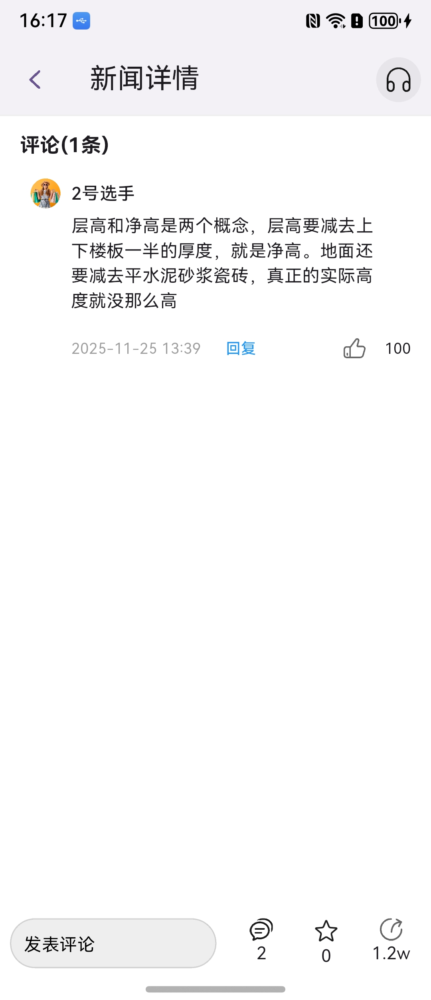
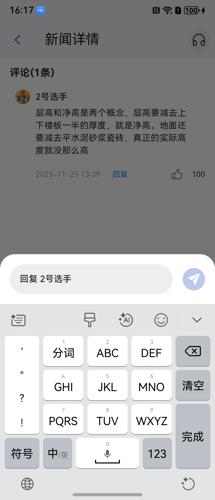
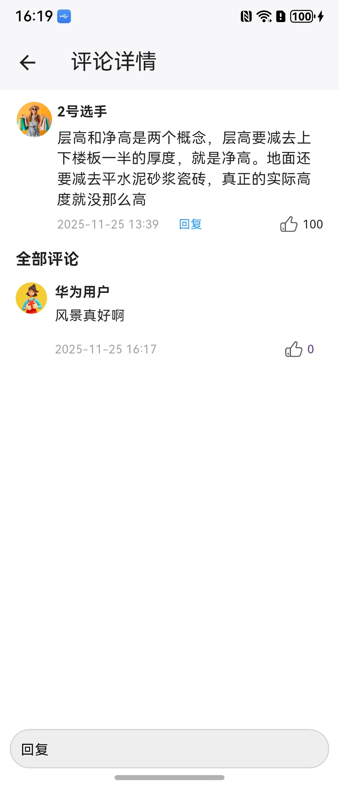
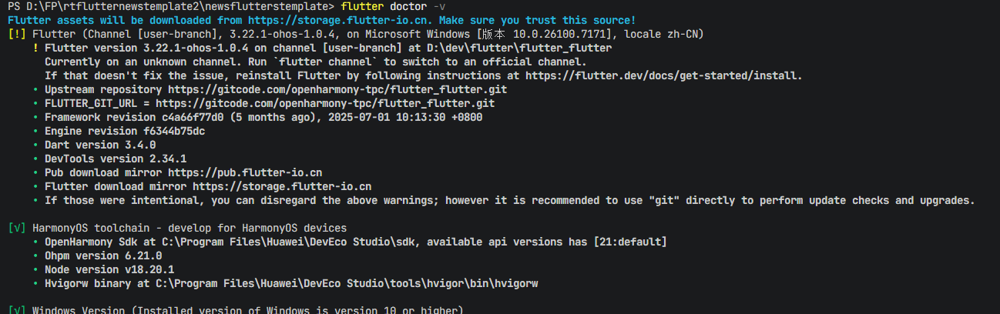

# 评论Flutter组件快速入门

## 目录

- [简介](#简介)
- [约束与限制](#约束与限制)
- [快速入门](#快速入门)
- [API参考](#api参考)
- [示例代码](#示例代码)
- [注意事项](#注意事项)
- [参考文档](#参考文档)

## 简介

module_flutter_feedcomment 是一个 Flutter跨端评论管理组件，支持在 HarmonyOS 平台使用，提供完整的评论功能。如果您的新闻类Flutter项目中需要使用评论功能，可以直接将此组件集成到项目中。包括评论列表展示、评论输入、点赞评论、回复评论等功能，适用于新闻、内容聚合类应用的互动评论。

组件包含的主要功能如下：
- 评论列表：展示评论列表（包括用户头像、昵称、评论内容、评论发布时间）
- 添加评论：点击“写评论”按钮后，会弹出输入框输入评论内容
- 回复评论：点击“回复”按钮或长按评论内容，会弹出输入框回复评论
- 删除评论：长按评论内容可以删除评论


本组件工程代码结构如下所示：

```text
module_flutter_feedcomment/
├── lib/
│   ├── components/
│   │   ├── coomment_card.dart         // 评论卡片组件
│   │   ├── press_action.dart          // 长按操作组件
│   │   ├── publish_comment.dart       // 发布评论组件
│   │   └── total_comment.dart         // 评论总数组件
│   ├── constants/
│   │   └── constants.dart             // 常量定义文件
│   ├── models/
│   │   └── model.dart                 // 数据模型定义
│   ├── utils/
│   │   ├── common_confirm_dialog.dart // 确认弹窗组件
│   │   ├── common_toast_dialog.dart   // 提示弹窗组件
│   │   ├── event_dispatcher.dart      // 事件分发器
│   │   ├── send_button.dart           // 发送按钮组件
│   │   └── utils.dart                 // 工具函数
│   ├── viewModel/
│   │   └── feed_comment_VM.dart       // 评论视图模型
│   ├── views/
│   │   └── feed_comment.dart          // 评论主视图
│   └── module_feedcomment.dart        // 组件导出入口文件
├── assets/
│   ├── arrow_down.svg                 // 向下箭头图标
│   ├── arrow_up.svg                   // 向上箭头图标
│   ├── comment_like_active_dark.svg   // 点赞激活暗色图标
│   ├── comment_like_active.svg        // 点赞激活图标
│   ├── comment_like.svg               // 点赞图标
│   ├── give_like_active.svg           // 点赞激活图标
│   ├── give_like_dark.svg             // 点赞暗色图标
│   ├── give_like.svg                  // 点赞图标
│   ├── icon_default.svg               // 默认图标
│   ├── like1.svg                      // 点赞图标
│   ├── message_active.svg             // 消息激活图标
│   ├── message.svg                    // 消息图标
│   ├── publish.svg                    // 发布图标
│   ├── share_active.svg               // 分享激活图标
│   └── share.svg                      // 分享图标
├── README.md                          // 组件说明文档
└── pubspec.yaml                       // 组件依赖配置
```


| 评论区域                                     | 评论回复                                     | 评论详情                                     |
| ---------------------------------------- | ---------------------------------------- | ---------------------------------------- |
|  |  |  |

## 约束与限制

### 环境

- DevEco Studio版本：DevEco Studio 5.1.0 Release及以上
- HarmonyOS SDK版本：HarmonyOS 5.1.0 Release SDK及以上
- 设备类型：华为手机（包括双折叠）
- 系统版本：HarmonyOS 5.1.0(18)及以上
- Flutter版本：Flutter 3.22.1-ohos-1.0.4
- Dart版本：Dart 3.4.0及以上


## 快速入门

### 配置环境

以下环境变量配置，类似Unix系统（Linux、Mac），可参照配置，Windows下环境变量配置请在“编辑系统环境变量”中设置。

1. 配置HarmonyOS环境变量 (HarmonyOS SDK、node、ohpm、hvigor)。

```
export TOOL_HOME=/Applications/DevEco-Studio.app/Contents # mac环境
export DEVECO_SDK_HOME=$TOOL_HOME/sdk 
export PATH=$TOOL_HOME/tools/ohpm/bin:$PATH 
export PATH=$TOOL_HOME/tools/hvigor/bin:$PATH 
export PATH=$TOOL_HOME/tools/node/bin:$PATH
```

在 Windows 上还需要配置一个名为HOS_SDK_HOME的系统变量，值为DevEco Studio sdk的安装路径，示例如下：


2. 通过代码工具下载flutter sdk仓库代码，tag 为 3.22.1-ohos-1.0.1。
```
git clone -b 3.22.1-ohos-1.0.1 https://gitcode.com/openharmony-tpc/flutter_flutter.git
```
3. 并配置如下环境：
```
export PUB_CACHE=D:/PUB(自定义路径)
export PATH=<flutter_flutter path>/bin:$PATH
export FLUTTER_GIT_URL=https://gitcode.com/openharmony-tpc/flutter_flutter.git
export PUB_HOSTED_URL=https://pub.flutter-io.cn//暂用国内镜像
export FLUTTER_STORAGE_BASE_URL=https://storage.flutter-io.cn//暂用国内镜像
```

Windows 环境变量配置示例如下（请按照实际安装目录配置）：

- 系统变量
  ​
- 环境变量
  


### 检查环境

运行 flutter doctor -v 检查环境变量配置是否正确，**Flutter**与**OpenHarmony**应都为ok标识，若两处提示缺少环境，按提示补充相应环境即可（**Flutter**处为感叹号标识无影响）。




### 运行调试工程

#### 方式一：基于本 Flutter 工程直接运行

1. 进入本组件的 Flutter 工程目录，通过终端执行 flutter pub get 和 flutter build hap。
2. 通过 DevEco Studio 打开工程目录中的 ohos 工程，连接模拟器或者真机，手工配置签名。
3. 在 Flutter 工程目录或者子目录 ohos 中，通过 flutter devices 指令发现 ohos 设备。
4. 在 Flutter 工程目录中，通过 flutter run -d <device-id> 指令运行调试，也可以通过 DevEco Studio 点击 Run 运行 ohos 工程（适合真机，模拟器不适用）。

#### 方式二：创建 Flutter 工程运行

1. 创建工程：

   ```
   # 创建工程，工程名支持小写和下划线
   flutter create --platforms ohos <projectName>
   ```
2. 拷贝 Flutter 工程内容和配置身份标识。

   将本组件 Flutter 工程中 lib、assets、pubspec.yaml 等文件拷贝到当前新建工程中，并且将身份标识 assets/string.json
   文件中的内容，附加在当前新建工程的文件 ohos/entry/src/main/resources/base/element/string.json 中。
3. 编译运行。

   在当前新建的 Flutter 工程目录下，编译运行的详细步骤请参考 [运行调试工程](#运行调试工程) 的方式一。### 安装组件

#### 步骤 1：添加依赖
   
   完成以上步骤后从生态市场下载组件，请参考以下步骤安装组件。

   a. 解压下载的组件包，将包中所有文件夹拷贝至您工程根目录的components目录下。

   b. 在项目根目录pubspec.yaml文件中添加module_feedcomment模块（引用时注意文件嵌套，示例为三层架构引用示例）。


   ```
   dependencies:
     module_flutter_feedcomment:
       path: '../../xxx/module_flutter_feedcomment'
   ```

#### 步骤 2：安装依赖

a. 运行以下命令安装依赖：
   ```
   flutter pub get
   ```

b. 引入组件：

   ```
   import 'package:module_flutter_feedcomment/module_feedcomment.dart';
   ```

c. 调用组件，详细组件调用参见[示例代码](#示例代码)：

   ```
   import 'package:flutter/material.dart';
   import 'package:module_flutter_feedcomment/module_feedcomment.dart';

   class CommentScreen extends StatelessWidget {
     @override
     Widget build(BuildContext context) {
       return Scaffold(
         appBar: AppBar(title: const Text('评论功能')),
         body: FeedComment(
           ...
         ),
       );
     }
   }
   ```


## API参考

### 接口


FeedComment(option: [FeedCommentOptions](#FeedCommentOptions对象说明))

评论功能主组件，提供评论列表展示、评论输入、点赞评论、回复评论等功能。

**参数：**

| 参数名 | 类型 | 是否必填 | 说明         |
|:--------|:----------------|:-----|:-----------|
| options | [FeedCommentOptions](#FeedCommentOptions对象说明) | 否 | 配置评论组件的参数。 |


### FeedCommentOptions对象说明

| 参数名                   | 类型                            | 是否必填 | 说明       |
|:---------------------|:-----------------------------|:-----|:--------|
| commentList           | List<[CommentInfo](#commentinfo类说明)>             | 是    | 评论列表     |
| author                | [AuthorInfo](#authorinfo类说明)                    | 是    | 当前用户信息   |
| fontSizeRatio         | double                        | 否    | 字体缩放比例   |
| isDark                | bool                          | 否    | 是否暗色模式   |
| addComment            | Function([CommentInfo](#commentinfo类说明), String) | 是    | 回复评论回调   |
| giveLike              | Function([CommentInfo](#commentinfo类说明), bool)   | 是    | 点赞评论回调   |
| onGoAuthorInfo        | Function(String)              | 是    | 跳转作者主页回调 |
| onInterceptLogin      | Function(Function(bool))      | 是    | 拦截登录回调   |
| onDeleteComment       | Function(String)              | 是    | 删除评论回调   |
| onFirstComment        | Function(String)              | 是    | 首次评论回调   |
| commentTopViewBuilder | WidgetBuilder                 | 是    | 顶部视图构建器  |

### CommentInfo类说明

| 属性名            | 类型                | 是否必填 | 说明     |
|:-------------|:----------------|:-----|:--------|
| commentId      | String            | 是    | 评论id   |
| newsId         | String            | 是    | 新闻id   |
| parentComment  | [CommentInfo](#commentinfo类说明)       | 否    | 父评论信息  |
| author         | [AuthorInfo](#authorinfo类说明)        | 是    | 评论用户信息 |
| commentBody    | String            | 是    | 评论内容   |
| commentLikeNum | int               | 是    | 评论点赞数量 |
| createTime     | int              |   | 是    | 创建时间   |
| isLiked        | bool              | 是    | 是否点赞   |
| likeCount      | int               | 否    | 点赞数量   |
| replyComments  | List<[CommentInfo](#commentinfo类说明)> | 否    | 子评论列表  |

### AuthorInfo类说明

| 属性名            | 类型     | 是否必填 | 说明   |
|:-------------|:-----|:-----|:----|
| authorId       | String | 是    | 用户ID |
| authorNickName | String | 是    | 昵称   |
| authorIcon     | String | 是    | 头像   |
| authorDesc     | String | 否    | 详情   |
| authorIp       | String | 否    | IP地址 |
| watchersCount  | int    | 否    | 关注数量 |
| followersCount | int    | 否    | 收藏数量 |
| likeNum        | int    | 否    | 点赞数量 |

## 示例代码

```
// 引入必要的包
import 'package:flutter/material.dart';
import 'package:module_flutter_feedcomment/module_feedcomment.dart';
import 'package:module_flutter_feedcomment/utils/common_toast_dialog.dart';
import 'package:module_flutter_feedcomment/utils/utils.dart';

class CommentScreen extends StatelessWidget {
  @override
  Widget build(BuildContext context) {
    return Scaffold(
      appBar: AppBar(title: const Text('评论功能')),
      body: CommentDemo(),
    );
  }
}

class CommentDemo extends StatefulWidget {
  @override
  _CommentDemoState createState() => _CommentDemoState();
}

class _CommentDemoState extends State<CommentDemo> {
  // 评论列表数据
  late List<CommentInfo> commentList = [];
  // 深色模式标识
  bool isDark = false;
  // 字体缩放比例
  double fontSizeRatio = 1.0;

  @override
  Widget build(BuildContext context) {
    return Scaffold(
      backgroundColor: isDark ? Colors.black : Colors.white,
      body: Padding(
        padding: const EdgeInsets.symmetric(horizontal: 16.0), 
        child: Column(
          children: [
            SizedBox(height: MediaQuery.of(context).padding.top),
            Expanded(
              child: FeedComment(
                // 当前用户信息
                author: AuthorInfo(
                  authorId: '1', 
                  authorNickName: '华为用户', 
                  authorIcon: 'https://agc-storage-drcn.platform.dbankcloud.cn/v0/news-hnp2d/avatar%2Favatar_9.jpg'
                ),
                // 评论列表数据
                commentList: commentList,
                // 字体缩放比例
                fontSizeRatio: fontSizeRatio,
                // 是否为深色模式
                isDark: isDark,
                // 添加评论回调
                addComment: (commentInfo, replyContent) {
                  print('添加评论: $replyContent');
                  // 创建新评论对象
                  CommentInfo currentComment = CommentInfo(
                    commentId: '${commentInfo.commentId}_${(DateTime.now().millisecondsSinceEpoch % 10)}',
                    newsId: commentInfo.newsId,
                    author: AuthorInfo(
                      authorId: '1', 
                      authorNickName: '华为用户', 
                      authorIcon: 'https://agc-storage-drcn.platform.dbankcloud.cn/v0/news-hnp2d/avatar%2Favatar_9.jpg'
                    ),
                    commentBody: replyContent,
                    commentLikeNum: 0,
                    createTime: DateTime.now().millisecondsSinceEpoch,
                    isLiked: false,
                    replyComments: [],
                    parentComment: commentInfo,
                  );
                  // 更新UI
                  setState(() {
                    commentInfo.replyComments.insert(0, currentComment);
                  });
                },
                // 点赞评论回调
                giveLike: (commentInfo, isLike) {
                  print('点赞评论: ${commentInfo.commentId}');
                  // 更新点赞状态和数量
                  setState(() {
                    commentInfo.isLiked = isLike;
                    if (isLike) {
                      commentInfo.commentLikeNum++;
                    } else {
                      commentInfo.commentLikeNum--;
                    }
                  });
                },
                // 跳转作者主页回调
                onGoAuthorInfo: (authorId) {
                  print('查看作者: $authorId');
                  // 显示作者信息提示
                  CommonToastDialog.show(
                    ToastDialogParams(
                      message: '作者id:$authorId',
                      duration: const Duration(milliseconds: 2000),
                    ),
                    context
                  );
                },
                // 拦截登录回调
                onInterceptLogin: (callback) {
                  // 模拟已登录状态
                  callback(true);
                },
                // 删除评论回调
                onDeleteComment: (commentId) {
                  setState(() {
                    // 递归删除评论及其子评论
                    deleteCommentAndChildren(commentList, commentId);
                  });
                },
                // 首次评论回调
                onFirstComment: (commentId) {
                  print('评论: $commentId');
                  comment(commentId);
                },
                // 自定义顶部视图构建器
                commentTopViewBuilder: (context) => Container(),
              ),
            ),
            // 发表评论按钮
            GestureDetector(
              onTap: () {
                commentSheetOpen(
                  context,
                  null,
                  (commentContent) {
                    comment(commentContent);
                  },
                );
              },
              child: Container(
                height: 40,
                width: MediaQuery.of(context).size.width,
                decoration: BoxDecoration(
                  borderRadius: BorderRadius.circular(8),
                  color: isDark ? Colors.grey[800] : Colors.grey[200],
                ),
                child: Center(child: Text(
                  '发表评论',
                  style: TextStyle(
                    fontSize: 16 * fontSizeRatio,
                    color: isDark ? Colors.grey[400] : Colors.grey[600],
                  ),
                )),
              ),
            ),
            SizedBox(height: MediaQuery.of(context).padding.bottom),
          ],
        ),
      ),
    );
  }

  // 添加新评论
  void comment(String commentContent) {
    CommentInfo info = CommentInfo(
      commentBody: commentContent, 
      commentId: '${(DateTime.now().millisecondsSinceEpoch % 10)}',
      newsId: '11',
      author: AuthorInfo(
        authorId: '1', 
        authorNickName: '华为用户', 
        authorIcon: 'https://agc-storage-drcn.platform.dbankcloud.cn/v0/news-hnp2d/avatar%2Favatar_9.jpg'
      ),
      replyComments: [],
      createTime: DateTime.now().millisecondsSinceEpoch,
      isLiked: false,
      commentLikeNum: 0,
    );
    
    setState(() {
      commentList.add(info);
    });
  }

  // 递归删除评论及其子评论
  void deleteCommentAndChildren(List<CommentInfo> comments, String targetId) {
    for (int i = comments.length - 1; i >= 0; i--) {
      CommentInfo comment = comments[i];
      if (comment.commentId == targetId) {
        comments.removeAt(i);
        return;
      } else {
        deleteCommentAndChildren(comment.replyComments, targetId);
      }
    }
  }
}
```

## 注意事项

a. **评论数据格式**：确保提供的commentList数据格式正确，每个CommentInfo对象必须包含必要的属性，以保证评论列表正确显示。

b. **性能优化**：当评论数量较多时，建议实现分页加载机制，避免一次性加载过多评论数据导致内存占用过大或渲染性能下降。

c. **回调函数实现**：所有必要的回调函数（如addComment、giveLike等）必须正确实现，以确保评论的完整功能可用。

d. **登录拦截处理**：在onInterceptLogin回调中，需要正确实现登录检查逻辑，并调用传入的回调函数返回登录状态，以保证用户体验的连贯性。

e. **深色模式适配**：通过isDark参数控制组件的深色模式显示，请确保在应用的主题切换时同步更新此参数。

f. **字体大小适配**：使用fontSizeRatio参数可以根据用户设置调整评论区字体大小，建议与应用的全局字体设置保持一致。

g. **评论内容安全**：在实现评论功能时，建议添加内容审核机制，过滤不当内容，确保应用内容的健康性。

h. **HarmonyOS平台特殊说明**：在HarmonyOS平台上使用时，需确保DevEco Studio和HarmonyOS SDK版本满足要求，且正确配置了Flutter与HarmonyOS的交互。

i. **头像资源**：确保AuthorInfo中的authorIcon字段提供有效的图片URL，以正确显示用户头像。

## 参考文档

[OpenHarmony Flutter SDK开发文档](https://gitcode.com/openharmony-tpc/flutter_flutter/blob/3.22.1-ohos-1.0.1/README.md)

[鸿蒙版Flutter环境搭建指导](https://gitcode.com/openharmony-tpc/flutter_samples/blob/master/ohos/docs/03_environment/openHarmony-flutter%E7%8E%AF%E5%A2%83%E6%90%AD%E5%BB%BA%E6%8C%87%E5%AF%BC.md)
