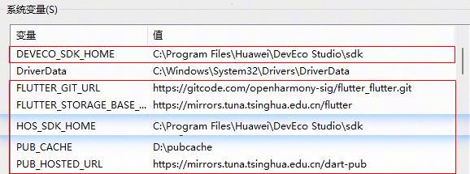

# 高亮Flutter组件快速入门

## 目录

- [简介](#简介)
- [约束与限制](#约束与限制)
- [快速入门](#快速入门)
- [API参考](#API参考)
- [示例代码](#示例代码)
- [注意事项](#注意事项)
- [参考文档](#参考文档)

## 简介

module_flutter_highlight 是一个 Flutter跨端文本高亮组件，支持在 HarmonyOS 平台使用，提供高效的文本关键词高亮功能。如果您的应用需要实现文本搜索结果高亮、关键词标记等功能，可以直接将此组件集成到项目中。

组件包含的主要功能如下：
- 多关键词高亮：支持同时高亮多个关键词
- 自定义样式：可自定义高亮文本和普通文本的颜色、字体大小、字重
- 正则表达式安全：自动转义正则表达式特殊字符
- 文本截断：支持配置最大行数和文本溢出处理方式
- 字体缩放：支持通过倍率调整字体大小，适应不同显示需求

本组件工程代码结构如下所示：

```text
module_flutter_highlight/
├── lib/
│   ├── constants/
│   │   └── constants.dart        // 常量定义文件
│   ├── model/
│   │   └── model.dart            // 数据模型定义
│   └── views/
│       └── high_light.dart       // 文本高亮组件实现
├── screenshots/
│   └── highlight.png             // 组件展示截图
├── README.md                     // 组件说明文档
└── pubspec.yaml                  // 组件依赖配置
```


## 约束与限制

### 环境

- DevEco Studio版本：DevEco Studio 5.1.0 Release及以上
- HarmonyOS SDK版本：HarmonyOS SDK 5.1.0 Release SDK及以上
- 设备类型：华为手机（包括双折叠）
- 系统版本：HarmonyOS 5.1.0(18)及以上
- Flutter版本：Flutter 3.22.1-ohos-1.0.4
- Dart版本：Dart 3.4.0及以上

## 快速入门
### 配置环境

以下环境变量配置，类似 Unix 系统（Linux、Mac），可参照配置，Windows 下环境变量配置请在“编辑系统环境变量”中设置。
  
  1. 配置 HarmonyOS 环境变量（HarmonyOS SDK、node、ohpm、hvigor）：
     ```
     export TOOL_HOME=/Applications/DevEco-Studio.app/Contents # mac环境
     export DEVECO_SDK_HOME=$TOOL_HOME/sdk 
     export PATH=$TOOL_HOME/tools/ohpm/bin:$PATH 
     export PATH=$TOOL_HOME/tools/hvigor/bin:$PATH 
     export PATH=$TOOL_HOME/tools/node/bin:$PATH
     ```
     在 Windows 上还需要配置一个名为 HOS_SDK_HOME 的系统变量，值为 DevEco Studio SDK 的安装路径，示例如下：
     
     


  2. 通过代码工具下载 Flutter SDK 仓库代码，tag 为 3.22.1-ohos-1.0.4：
     ```
     git clone -b 3.22.1-ohos-1.0.4 https://gitcode.com/openharmony-tpc/flutter_flutter.git
     ```

     并配置如下环境：

     ```
     export PUB_CACHE=D:/PUB(自定义路径)
     export PATH=<flutter_flutter path>/bin:$PATH
     export FLUTTER_GIT_URL=https://gitcode.com/openharmony-tpc/flutter_flutter.git
     export PUB_HOSTED_URL=https://pub.flutter-io.cn # 暂用国内的镜像
     export FLUTTER_STORAGE_BASE_URL=https://storage.flutter-io.cn # 暂用国内的镜像
     ```
     Windows 环境变量配置示例如下（请按照实际安装目录配置）：
    - 系统变量截图
         
    - 环境变量截图
         

### 检查环境

运行 flutter doctor -v 检查环境变量配置是否正确，**Flutter**与**OpenHarmony**应都为ok标识，若两处提示缺少环境，按提示补充相应环境即可（**Flutter**处为感叹号标识无影响）。


### 运行调试工程

#### 方式一：基于本 Flutter 工程直接运行

1. 进入本组件的 Flutter 工程目录，通过终端执行 flutter pub get 和 flutter build hap。
2. 通过 DevEco Studio 打开工程目录中的 ohos 工程，连接模拟器或者真机，手工配置签名。
3. 在 Flutter 工程目录或者子目录 ohos 中，通过 flutter devices 指令发现 ohos 设备。
4. 在 Flutter 工程目录中，通过 flutter run -d <device-id> 指令运行调试，也可以通过 DevEco Studio 点击 Run 运行 ohos 工程（适合真机，模拟器不适用）。

#### 方式二：创建 Flutter 工程运行

1. 创建工程：

   ```
   # 创建工程，工程名支持小写和下划线
   flutter create --platforms ohos <projectName>
   ```
2. 拷贝 Flutter 工程内容和配置身份标识。

   将本组件 Flutter 工程中 lib、assets、pubspec.yaml 等文件拷贝到当前新建工程中，并且将身份标识 assets/string.json
   文件中的内容，附加在当前新建工程的文件 ohos/entry/src/main/resources/base/element/string.json 中。
3. 编译运行。

   在当前新建的 Flutter 工程目录下，编译运行的详细步骤请参考 [运行调试工程](#运行调试工程) 的方式一。
### 安装组件

#### 步骤 1：添加依赖
   
   完成以上步骤后从生态市场下载组件，请参考以下步骤安装组件。

   a. 解压下载的组件包，将包中所有文件夹拷贝至您工程根目录的components目录下。

   b. 在项目根目录pubspec.yaml文件中添加module_flutter_highlight模块（引用时注意文件嵌套，示例为三层架构引用示例）。


   ```
   dependencies:
     module_flutter_highlight:
       path: '../../xxx/module_flutter_highlight'
   ```

#### 步骤 2：安装依赖

a. 运行以下命令安装依赖：
   ```
   flutter pub get
   ```

b. 引入组件：

   ```
   import 'package:module_flutter_highlight/views/high_light.dart';
   ```

c. 调用组件，详细组件调用参见[示例代码](#示例代码)：

   ```
   import 'package:flutter/material.dart';
   import 'package:module_flutter_highlight/views/high_light.dart';

   class HighlightDemo extends StatelessWidget {
     @override
     Widget build(BuildContext context) {
       return Scaffold(
         appBar: AppBar(),
         body: ListView(
           children: [
             Highlight(
               ...
             ),
           ],
         ),
       );
     }
   }
   ```

## API参考

### 接口

Highlight(option: [HighlightOptions](#highlightoptions对象说明))

文本高亮组件的参数

**参数：**

| 参数名 | 类型 | 是否必填 | 说明 |
|:--------|:----------------|:-----|:-----------|
| options | [HighlightOptions](#highlightoptions对象说明) | 否 | 配置文本高亮组件的参数。 |

### HighlightOptions对象说明

| 参数名 | 类型 | 是否必填 | 说明 |
|:------------------|:----------------|:--------|:----------------|
| keywords | List<String> | 否 | 高亮关键字列表 |
| sourceString | String | 否 | 源文本 |
| textColor | Color | 否 | 文字颜色 |
| highLightColor | Color | 否 | 高亮文字颜色 |
| textFontSize | double | 否 | 文字大小 |
| textFontWeight | FontWeight | 否 | 文本weight |
| highLightFontSize | double | 否 | 高亮文字大小 |
| maxLines | int | 否 | 最大行数 |
| overflow | TextOverflow | 否 | 超出隐藏 |

## 示例代码

```
import 'package:flutter/material.dart';
import 'package:module_flutter_highlight/views/high_light.dart';

class HighlightDemo extends StatelessWidget {
  @override
  Widget build(BuildContext context) {
    return Scaffold(
      appBar: AppBar(title: const Text('文本高亮示例')),
      body: ListView(
        padding: const EdgeInsets.all(16),
        children: const [
          Highlight(
            keywords: ['旅行'],
            sourceString: '假期的旅行碎片已加载完毕～。旅行哪里是逃离呀，分明是让你在人山人海里，重新找到自己的位置',
            highLightColor: Color(0xFFE84026),
            textColor: Color(0xFF000000),
            textFontSize: 16,
            textFontWeight: FontWeight.normal,
            highLightFontSize: 16,
            maxLines: 3,
            overflow: TextOverflow.ellipsis,
          ),
        ],
      ),
    );
  }
}
```

## 注意事项

1. **关键词格式**：确保提供的keywords列表格式正确，避免包含过多空值或特殊字符，以保证正则匹配的准确性。

2. **性能优化**：当sourceString文本较长或keywords数量较多时，请注意性能优化，避免出现卡顿现象。

3. **高亮颜色**：建议highLightColor与textColor保持足够的对比度，以确保高亮文本的可读性。

4. **正则特殊字符**：如果关键词中包含正则表达式特殊字符（如.、*、?、+、^等），组件内部已进行转义处理，无需手动转义。

5. **空值处理**：当keywords为空列表或sourceString为空字符串时，组件将正常渲染但不会进行任何高亮处理。

6. **大小写敏感性**：当前关键词匹配为不区分大小写，如需区分大小写功能，可根据实际需求扩展组件功能。

7. **文本样式一致性**：为保证视觉效果，建议highLightFontSize与textFontSize保持一致或相差不大。


## 参考文档

[OpenHarmony Flutter SDK开发文档](https://gitcode.com/openharmony-tpc/flutter_flutter/blob/3.22.1-ohos-1.0.1/README.md)

[鸿蒙版Flutter环境搭建指导](https://gitcode.com/openharmony-tpc/flutter_samples/blob/master/ohos/docs/03_environment/openHarmony-flutter%E7%8E%AF%E5%A2%83%E6%90%AD%E5%BB%BA%E6%8C%87%E5%AF%BC.md)
